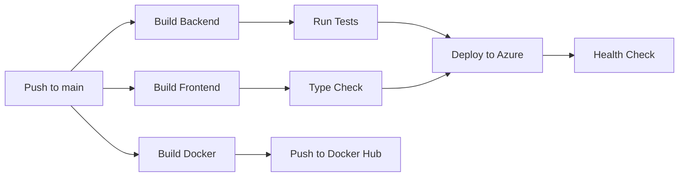

# CI/CD Setup Guide

## 🚀 GitHub Actions CI/CD Pipeline

Đã tạo 3 workflows cho project:

### 📋 Workflows Created

1. **`ci-cd.yml`** - Pipeline đầy đủ với build, test, deploy
2. **`azure-deploy.yml`** - Deploy đơn giản lên Azure
3. **`docker-build.yml`** - Build và push Docker image

---

## ⚙️ Setup Instructions

### **Option 1: Deploy to Azure App Service** ☁️

#### Bước 1: Tạo Azure Web App

```bash
# Login to Azure
az login

# Create resource group
az group create --name RoomEnglishRG --location eastus

# Create App Service plan
az appservice plan create \
  --name RoomEnglishPlan \
  --resource-group RoomEnglishRG \
  --sku B1 \
  --is-linux

# Create Web App
az webapp create \
  --name YourAppName \
  --resource-group RoomEnglishRG \
  --plan RoomEnglishPlan \
  --runtime "DOTNETCORE:8.0"
```

#### Bước 2: Get Publish Profile

**Azure Portal:**
1. Vào Azure Portal → Your Web App
2. Click **Get publish profile** (Download)
3. Copy toàn bộ nội dung file XML

**CLI:**
```bash
az webapp deployment list-publishing-profiles \
  --name YourAppName \
  --resource-group RoomEnglishRG \
  --xml
```

#### Bước 3: Configure GitHub Secrets

Vào GitHub repository → **Settings** → **Secrets and variables** → **Actions**

Tạo các secrets sau:

| Secret Name | Value | Description |
|-------------|-------|-------------|
| `AZURE_WEBAPP_NAME` | `YourAppName` | Tên Azure Web App của bạn |
| `AZURE_WEBAPP_PUBLISH_PROFILE` | `<paste XML>` | Publish profile từ bước 2 |

#### Bước 4: Configure Azure App Settings

**Azure Portal → Configuration → Application settings:**

```
Authentication__BearerToken__ExpirationDays = 7
OpenAI__ApiKey = your-openai-api-key
ASPNETCORE_ENVIRONMENT = Production
```

**Connection Strings:**
```
RoomEnglishDb = Server=your-server.database.windows.net;Database=RoomEnglishDb;User Id=admin;Password=YourPassword;
```

#### Bước 5: Update workflow file

Sửa file `.github/workflows/azure-deploy.yml`:

```yaml
env:
  AZURE_WEBAPP_NAME: 'your-actual-app-name'  # Replace this
```

#### Bước 6: Push to main branch

```bash
git add .
git commit -m "Add CI/CD pipeline"
git push origin main
```

✅ **Done!** Workflow sẽ tự động chạy và deploy.

---

### **Option 2: Build Docker Image** 🐳

#### Bước 1: Create Docker Hub Account

1. Tạo account tại https://hub.docker.com
2. Tạo repository: `roomenglish`

#### Bước 2: Configure GitHub Secrets

| Secret Name | Value | Description |
|-------------|-------|-------------|
| `DOCKER_USERNAME` | `your-username` | Docker Hub username |
| `DOCKER_PASSWORD` | `your-password` | Docker Hub password/token |

#### Bước 3: Push to GitHub

```bash
git add .
git commit -m "Add Docker CI/CD"
git push origin main
```

#### Bước 4: Pull & Run Image

Sau khi workflow chạy xong:

```bash
# Pull image
docker pull your-username/roomenglish:latest

# Run container
docker run -d -p 5000:80 \
  -e ConnectionStrings__RoomEnglishDb="YourConnectionString" \
  -e OpenAI__ApiKey="your-key" \
  --name roomenglish \
  your-username/roomenglish:latest
```

---

### **Option 3: Full CI/CD Pipeline** 🔄

File `ci-cd.yml` bao gồm:

- ✅ Backend build & test
- ✅ Frontend build & lint
- ✅ Deploy to Azure
- ✅ Build & push Docker image
- ✅ Security scan

**Required Secrets:**

```
AZURE_WEBAPP_NAME
AZURE_WEBAPP_PUBLISH_PROFILE
DOCKER_USERNAME
DOCKER_PASSWORD
```

---

## 🎯 Workflow Triggers

### Automatic Triggers

```yaml
on:
  push:
    branches: [ main, develop ]  # Auto deploy on push to main/develop
  pull_request:
    branches: [ main ]            # Run tests on PR
```

### Manual Trigger

Có thể trigger manually:

1. GitHub → **Actions** tab
2. Chọn workflow
3. Click **Run workflow**

---

## 📊 Pipeline Flow



### Jobs Execution

1. **Backend Build & Test** (parallel)
   - Restore dependencies
   - Build .NET solution
   - Run unit tests
   - Publish artifacts

2. **Frontend Build** (parallel)
   - Install npm packages
   - Run lint
   - Type check
   - Build Vue app

3. **Deploy to Azure** (sequential)
   - Download artifacts
   - Combine backend + frontend
   - Deploy to Azure Web App

4. **Docker Build** (parallel)
   - Multi-stage build
   - Push to Docker Hub
   - Tag with commit SHA + latest

---

## 🔒 Security Best Practices

### 1. Use GitHub Secrets

**Never commit:**
- Connection strings
- API keys
- Passwords
- Certificates

### 2. Use Environments

Create environments in GitHub:

**Settings → Environments → New environment**

- `production` - requires approval
- `staging` - auto deploy

Example:
```yaml
jobs:
  deploy:
    environment:
      name: production
      url: https://yourdomain.com
```

### 3. Branch Protection

**Settings → Branches → Add rule:**

- ✅ Require pull request reviews
- ✅ Require status checks (CI must pass)
- ✅ Require signed commits
- ✅ Require linear history

---

## 🧪 Testing Locally

### Test Docker Build

```bash
cd src

# Build image
docker build -t roomenglish:test .

# Run locally
docker run -d -p 5000:80 \
  -e ConnectionStrings__RoomEnglishDb="Server=host.docker.internal;..." \
  roomenglish:test

# Check logs
docker logs -f <container-id>

# Test
curl http://localhost:5000/health
```

### Test Azure Deployment

```bash
# Simulate publish
cd src
dotnet publish Web/Web.csproj -c Release -o ./publish

# Test locally
cd publish
dotnet Web.dll
```

---

## 📈 Monitoring

### GitHub Actions

**View workflow runs:**
- GitHub → **Actions** tab
- Click on workflow run
- View logs for each job

### Azure Monitoring

**Application Insights:**
```bash
# Enable Application Insights in Azure Portal
# Add to appsettings.json
{
  "ApplicationInsights": {
    "InstrumentationKey": "your-key"
  }
}
```

---

## 🐛 Troubleshooting

### Common Issues

#### 1. Build fails on GitHub Actions

```bash
# Check logs in Actions tab
# Common causes:
- Missing secrets
- Wrong .NET version
- npm cache issues
```

**Fix:**
```yaml
- name: Clear npm cache
  run: npm cache clean --force
```

#### 2. Azure deployment succeeds but app doesn't work

```bash
# Check Azure logs
az webapp log tail --name YourAppName --resource-group RoomEnglishRG

# Common causes:
- Wrong connection string
- Missing environment variables
- Database not migrated
```

**Fix:**
```yaml
- name: Run migrations
  run: dotnet ef database update --project src/Infrastructure --startup-project src/Web
```

#### 3. Docker build fails

```bash
# Test locally first
docker build -t test ./src

# Common causes:
- Missing .dockerignore
- Wrong COPY paths
- npm install fails
```

**Fix:** Check Dockerfile paths relative to build context

---

## ✅ Verification Checklist

After setup, verify:

- [ ] GitHub Actions workflow completes successfully
- [ ] Azure Web App is running
- [ ] Database connection works
- [ ] Frontend loads correctly
- [ ] API endpoints respond
- [ ] Authentication works
- [ ] Health check endpoint returns 200
- [ ] Logs are visible in Azure
- [ ] Environment variables are set

---

## 🚀 Quick Start

### Minimal Setup (Azure only)

1. **Create secrets:**
   ```
   AZURE_WEBAPP_NAME
   AZURE_WEBAPP_PUBLISH_PROFILE
   ```

2. **Update workflow:**
   ```yaml
   env:
     AZURE_WEBAPP_NAME: 'your-app-name'
   ```

3. **Push to main:**
   ```bash
   git push origin main
   ```

4. **Done!** Check Actions tab for progress.

---

## 📚 Additional Resources

- [GitHub Actions Documentation](https://docs.github.com/en/actions)
- [Azure Web Apps Deployment](https://learn.microsoft.com/en-us/azure/app-service/)
- [Docker Documentation](https://docs.docker.com/)
- [.NET Deploy to Azure](https://learn.microsoft.com/en-us/dotnet/azure/)

---

## 🎯 Next Steps

1. **Setup staging environment**
   - Create separate Azure Web App for staging
   - Add `staging` environment in GitHub
   - Deploy `develop` branch to staging

2. **Add database migrations to pipeline**
   ```yaml
   - name: Run EF migrations
     run: dotnet ef database update
   ```

3. **Add automated tests**
   - Unit tests
   - Integration tests
   - E2E tests with Playwright

4. **Setup monitoring**
   - Application Insights
   - Log Analytics
   - Alerts for errors

5. **Performance optimization**
   - Enable caching in Azure
   - Add CDN for static files
   - Setup auto-scaling

Good luck! 🎉
