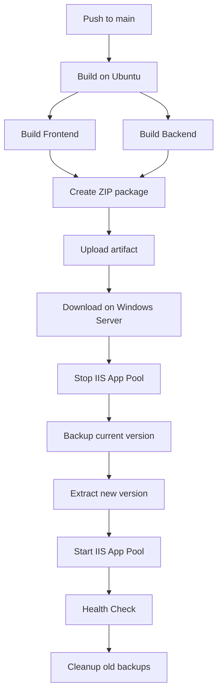

# Setup GitHub Actions Self-Hosted Runner for IIS Deployment

## 📋 Overview

Workflow `iis-deploy.yml` sẽ:
1. Build trên GitHub (Ubuntu runner)
2. Deploy tự động lên Windows Server (Self-hosted runner)
3. Stop IIS → Backup → Deploy → Start IIS
4. Health check tự động

---

## 🖥️ Setup Self-Hosted Runner on Windows Server

### **Bước 1: Cài đặt Prerequisites trên Windows Server**

```powershell
# PowerShell as Administrator

# 1. Install IIS (nếu chưa có)
Enable-WindowsOptionalFeature -Online -FeatureName IIS-WebServerRole
Enable-WindowsOptionalFeature -Online -FeatureName IIS-WebServer
Enable-WindowsOptionalFeature -Online -FeatureName IIS-ASPNET47

# 2. Install .NET 8 Hosting Bundle
# Download from: https://dotnet.microsoft.com/download/dotnet/8.0
# Chọn: Hosting Bundle for Windows

# 3. Restart IIS
iisreset

# 4. Create deployment directory
New-Item -Path "C:\inetpub\RoomEnglish" -ItemType Directory -Force
New-Item -Path "C:\Backups" -ItemType Directory -Force

# 5. Create IIS Application Pool
Import-Module WebAdministration
New-WebAppPool -Name "RoomEnglish"
Set-ItemProperty IIS:\AppPools\RoomEnglish -Name "managedRuntimeVersion" -Value ""
Set-ItemProperty IIS:\AppPools\RoomEnglish -Name "managedPipelineMode" -Value "Integrated"

# 6. Create IIS Website
New-Website -Name "RoomEnglish" `
  -PhysicalPath "C:\inetpub\RoomEnglish" `
  -ApplicationPool "RoomEnglish" `
  -Port 80
```

### **Bước 2: Add Self-Hosted Runner**

#### **A. Trên GitHub Repository:**

1. Vào repository → **Settings** → **Actions** → **Runners**
2. Click **New self-hosted runner** → Chọn **Windows**
3. GitHub sẽ hiển thị các commands để chạy

#### **B. Trên Windows Server:**

```powershell
# PowerShell as Administrator

# 1. Create runner directory
New-Item -Path "C:\actions-runner" -ItemType Directory -Force
cd C:\actions-runner

# 2. Download runner (copy commands from GitHub)
# Example:
Invoke-WebRequest -Uri https://github.com/actions/runner/releases/download/v2.311.0/actions-runner-win-x64-2.311.0.zip -OutFile actions-runner-win-x64-2.311.0.zip

# 3. Extract
Add-Type -AssemblyName System.IO.Compression.FileSystem
[System.IO.Compression.ZipFile]::ExtractToDirectory("$PWD/actions-runner-win-x64-2.311.0.zip", "$PWD")

# 4. Configure runner (copy token from GitHub)
./config.cmd --url https://github.com/YourUsername/RoomEnglish --token YOUR_TOKEN

# Khi được hỏi:
# - Runner name: windows-server-01
# - Runner group: Default
# - Labels: self-hosted,Windows,X64
# - Work folder: _work
```

#### **C. Install as Windows Service:**

```powershell
# PowerShell as Administrator
cd C:\actions-runner

# Install service
./svc.sh install

# Start service
./svc.sh start

# Check status
./svc.sh status
```

#### **D. Verify Runner:**

1. Trở lại GitHub → **Settings** → **Actions** → **Runners**
2. Sẽ thấy runner với status **Idle** (màu xanh)

---

## 🔐 Configure Permissions

### **Option 1: Run as SYSTEM (Recommended)**

Runner service mặc định chạy dưới quyền SYSTEM → Có quyền IIS

### **Option 2: Run as Specific User**

Nếu muốn chạy dưới user cụ thể:

```powershell
# PowerShell as Administrator
cd C:\actions-runner

# Uninstall current service
./svc.sh uninstall

# Install with specific user
./svc.sh install YourDomain\YourUser

# Start service
./svc.sh start
```

**Grant permissions:**

```powershell
# 1. Add user to IIS_IUSRS group
Add-LocalGroupMember -Group "IIS_IUSRS" -Member "YourDomain\YourUser"

# 2. Grant folder permissions
$acl = Get-Acl "C:\inetpub\RoomEnglish"
$rule = New-Object System.Security.AccessControl.FileSystemAccessRule("YourDomain\YourUser","FullControl","ContainerInherit,ObjectInherit","None","Allow")
$acl.SetAccessRule($rule)
Set-Acl "C:\inetpub\RoomEnglish" $acl

# 3. Grant IIS permissions
Import-Module WebAdministration
$appPool = Get-Item "IIS:\AppPools\RoomEnglish"
$appPool.processModel.identityType = "SpecificUser"
$appPool.processModel.userName = "YourDomain\YourUser"
$appPool.processModel.password = "YourPassword"
$appPool | Set-Item
```

---

## ⚙️ Configure Production Settings

### **1. Create appsettings.Production.json**

File: `src/Web/appsettings.Production.json`

```json
{
  "Logging": {
    "LogLevel": {
      "Default": "Information",
      "Microsoft.AspNetCore": "Warning"
    }
  },
  "AllowedHosts": "*",
  "ConnectionStrings": {
    "RoomEnglishDb": "Server=localhost\\SQLEXPRESS;Database=RoomEnglishDb;Integrated Security=True;TrustServerCertificate=True;"
  },
  "Authentication": {
    "BearerToken": {
      "ExpirationDays": 7
    }
  },
  "OpenAI": {
    "ApiKey": "your-openai-api-key"
  }
}
```

### **2. Or Use Environment Variables**

Set trong IIS Application Pool:

```powershell
# PowerShell
Import-Module WebAdministration

# Set environment variables
$appPool = Get-Item "IIS:\AppPools\RoomEnglish"
$appPool.environmentVariables.Add("ASPNETCORE_ENVIRONMENT", "Production")
$appPool.environmentVariables.Add("OpenAI__ApiKey", "your-key")
$appPool | Set-Item

# Restart app pool
Restart-WebAppPool -Name "RoomEnglish"
```

---

## 🚀 Deploy Workflow

### **How it works:**



### **Trigger deployment:**

```bash
# Option 1: Push to main
git add .
git commit -m "Deploy to production"
git push origin main

# Option 2: Manual trigger
# GitHub → Actions → Deploy to IIS → Run workflow
```

### **Monitor deployment:**

1. GitHub → **Actions** tab
2. Click on workflow run
3. Watch logs in real-time

---

## 🔍 Troubleshooting

### **1. Runner not connecting**

```powershell
# Check service
Get-Service actions.runner.*

# Check logs
Get-Content "C:\actions-runner\_diag\Runner_*.log" -Tail 50

# Restart service
Restart-Service actions.runner.*
```

### **2. Deployment fails at IIS step**

```powershell
# Check if runner has IIS permissions
Import-Module WebAdministration
Get-WebAppPool RoomEnglish

# Check deployment path
Test-Path "C:\inetpub\RoomEnglish"

# Check IIS logs
Get-Content "C:\inetpub\RoomEnglish\logs\stdout_*.log" -Tail 50
```

### **3. Application Pool fails to start**

```powershell
# Check Event Viewer
Get-EventLog -LogName Application -Source "ASP.NET Core*" -Newest 10

# Check app pool status
Get-WebAppPoolState -Name "RoomEnglish"

# Try starting manually
Start-WebAppPool -Name "RoomEnglish"
```

### **4. Health check fails**

```powershell
# Test locally
Invoke-WebRequest -Uri "http://localhost/health" -UseBasicParsing

# Check if app is running
netstat -ano | findstr :80

# Check application logs
Get-Content "C:\inetpub\RoomEnglish\Logs\*.txt" -Tail 50
```

---

## 🛡️ Security Best Practices

### **1. Firewall Rules**

```powershell
# Only allow GitHub Actions IPs (optional)
New-NetFirewallRule -DisplayName "GitHub Actions" `
  -Direction Inbound `
  -Protocol TCP `
  -LocalPort 80,443 `
  -Action Allow
```

### **2. Use Secrets for Sensitive Data**

**GitHub Secrets** (Settings → Secrets):
- `OPENAI_API_KEY`
- `DB_CONNECTION_STRING`

Update workflow:
```yaml
- name: Set environment variables
  shell: powershell
  run: |
    $appPool = Get-Item "IIS:\AppPools\RoomEnglish"
    $appPool.environmentVariables.Add("OpenAI__ApiKey", "${{ secrets.OPENAI_API_KEY }}")
```

### **3. Limit Runner Access**

```powershell
# Create dedicated user for runner
New-LocalUser -Name "GitHubRunner" -Password (ConvertTo-SecureString "SecurePassword123!" -AsPlainText -Force)

# Grant minimal permissions
icacls "C:\inetpub\RoomEnglish" /grant "GitHubRunner:(OI)(CI)F"
```

---

## 📊 Monitoring & Maintenance

### **1. Check Runner Status**

```powershell
# Service status
Get-Service actions.runner.*

# Recent logs
Get-Content "C:\actions-runner\_diag\Worker_*.log" -Tail 20
```

### **2. View Backups**

```powershell
# List backups
Get-ChildItem "C:\Backups" | Sort-Object CreationTime -Descending

# Restore from backup
$backupPath = "C:\Backups\RoomEnglish_20250128_143000"
Stop-WebAppPool -Name "RoomEnglish"
Remove-Item "C:\inetpub\RoomEnglish\*" -Recurse -Force
Copy-Item "$backupPath\*" -Destination "C:\inetpub\RoomEnglish" -Recurse
Start-WebAppPool -Name "RoomEnglish"
```

### **3. Application Logs**

```powershell
# IIS stdout logs
Get-Content "C:\inetpub\RoomEnglish\logs\stdout_*.log" -Tail 50 -Wait

# Application Event Log
Get-EventLog -LogName Application -Source "ASP.NET Core*" -Newest 20
```

---

## ✅ Deployment Checklist

Before first deployment:

- [ ] IIS installed and configured
- [ ] .NET 8 Hosting Bundle installed
- [ ] GitHub runner installed and running
- [ ] Application Pool created (`RoomEnglish`)
- [ ] Website created in IIS
- [ ] Deployment directory exists (`C:\inetpub\RoomEnglish`)
- [ ] Backup directory exists (`C:\Backups`)
- [ ] SQL Server configured and accessible
- [ ] `appsettings.Production.json` configured
- [ ] Firewall allows HTTP/HTTPS
- [ ] SSL certificate installed (for HTTPS)

---

## 🎯 Quick Commands Reference

```powershell
# --- Runner Management ---
# Start runner service
Start-Service actions.runner.*

# Stop runner service
Stop-Service actions.runner.*

# Check runner status
Get-Service actions.runner.*

# --- IIS Management ---
# Start app pool
Start-WebAppPool -Name "RoomEnglish"

# Stop app pool
Stop-WebAppPool -Name "RoomEnglish"

# Restart app pool
Restart-WebAppPool -Name "RoomEnglish"

# Check app pool status
Get-WebAppPoolState -Name "RoomEnglish"

# --- Deployment ---
# Manual backup
$date = Get-Date -Format "yyyyMMdd_HHmmss"
Copy-Item "C:\inetpub\RoomEnglish" -Destination "C:\Backups\RoomEnglish_$date" -Recurse

# Manual restore
Stop-WebAppPool -Name "RoomEnglish"
Remove-Item "C:\inetpub\RoomEnglish\*" -Recurse -Force
Copy-Item "C:\Backups\RoomEnglish_YYYYMMDD_HHMMSS\*" -Destination "C:\inetpub\RoomEnglish" -Recurse
Start-WebAppPool -Name "RoomEnglish"

# --- Logs ---
# View stdout logs
Get-Content "C:\inetpub\RoomEnglish\logs\stdout_*.log" -Tail 50 -Wait

# View Event Log
Get-EventLog -LogName Application -Source "ASP.NET Core*" -Newest 10 | Format-List

# View runner logs
Get-Content "C:\actions-runner\_diag\Worker_*.log" -Tail 50
```

---

## 🚀 Next Steps

1. **Setup Staging Environment**
   - Create separate site in IIS for staging
   - Add second runner (or use same runner with different label)
   - Create workflow for `develop` branch

2. **Add Database Migrations**
   ```yaml
   - name: Run migrations
     shell: powershell
     run: |
       cd "C:\inetpub\RoomEnglish"
       dotnet-ef database update
   ```

3. **Setup HTTPS**
   ```powershell
   # Install certificate
   Import-PfxCertificate -FilePath "cert.pfx" -CertStoreLocation Cert:\LocalMachine\My
   
   # Bind in IIS
   New-WebBinding -Name "RoomEnglish" -Protocol https -Port 443 -SslFlags 0
   ```

4. **Setup Monitoring**
   - Application Insights
   - Windows Performance Monitor
   - Custom health check endpoints

Good luck! 🎉
