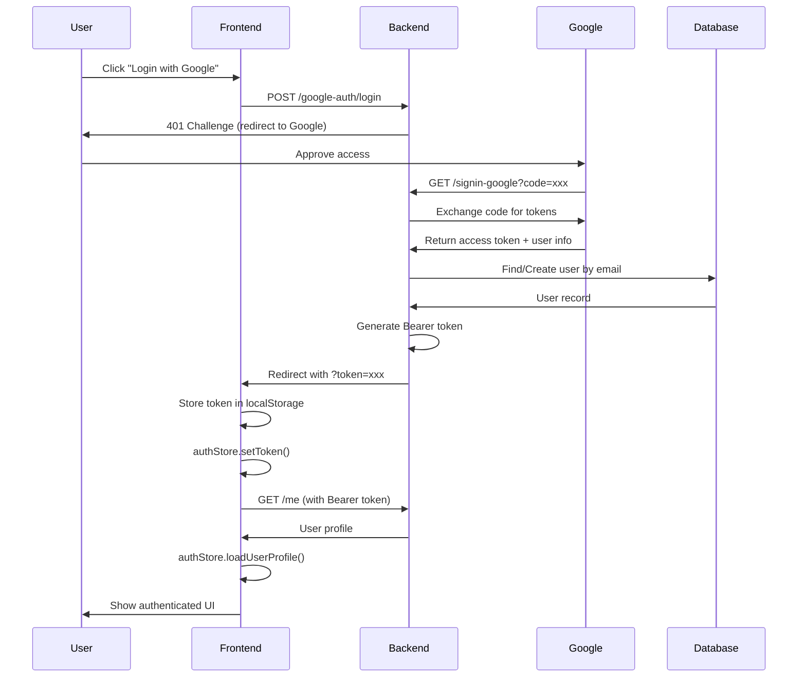

# Google OAuth Implementation Guide

## 📋 Overview

This document provides a comprehensive guide to the Google OAuth 2.0 implementation in RoomEnglish application. The implementation allows users to sign in using their Google account, with automatic account creation and seamless authentication flow.

## 🏗️ Architecture

### Authentication Flow Diagram

```
User clicks "Login with Google"
         ↓
Frontend: /auth/login (LoginView.vue)
         ↓
Backend: POST /google-auth/login
         ↓
Redirect to Google OAuth consent screen
         ↓
User approves access
         ↓
Google redirects back: GET /signin-google?code=...
         ↓
ASP.NET Core OAuth Middleware processes callback
         ↓
OnTicketReceived Event fires (GoogleOAuthHandler)
         ↓
Extract email from Google claims
         ↓
Check if user exists in database
         ↓
If not exists: Create new ApplicationUser
         ↓
Generate Bearer Token (7-day expiry)
         ↓
Redirect to: http://localhost:3000/auth/login?token={token}
         ↓
Frontend extracts token from URL
         ↓
Store in localStorage
         ↓
Sync with authStore
         ↓
Load user profile from /me endpoint
         ↓
Redirect to /learning
         ↓
✅ User authenticated and menu updated
```

## 📁 File Structure

### Backend Files

```
Infrastructure/
├── DependencyInjection.cs          # Authentication configuration
└── Identity/
    └── GoogleOAuthHandler.cs       # Google OAuth callback handler

Web/
└── Endpoints/
    └── GoogleAuth.cs               # Google login endpoint
```

### Frontend Files

```
Web/ClientApp/src/
├── modules/auth/views/
│   └── LoginView.vue               # Login page with OAuth callback handler
├── composables/
│   └── useAuth.ts                  # Auth composable (syncs with authStore)
├── stores/
│   └── auth.ts                     # Pinia auth store
└── services/
    └── authService.ts              # API communication layer
```

## 🔧 Backend Implementation

### 1. Authentication Configuration (DependencyInjection.cs)

```csharp
// Configure authentication schemes
services.AddAuthentication(options =>
{
    options.DefaultScheme = IdentityConstants.BearerScheme;
    options.DefaultSignInScheme = IdentityConstants.ApplicationScheme;
    options.DefaultChallengeScheme = hasGoogleAuth 
        ? IdentityConstants.ApplicationScheme 
        : IdentityConstants.BearerScheme;
})
.AddBearerToken(IdentityConstants.BearerScheme, options =>
{
    options.BearerTokenExpiration = TimeSpan.FromDays(tokenExpiryDays);
})
.AddIdentityCookies(); // Required for OAuth state preservation

// Configure Google OAuth
if (hasGoogleAuth)
{
    services.AddAuthentication()
        .AddGoogle(options =>
        {
            options.ClientId = googleClientId;
            options.ClientSecret = googleClientSecret;
            options.CallbackPath = "/signin-google"; // Must match Google Cloud Console
            options.SignInScheme = IdentityConstants.ExternalScheme;
            options.Events = GoogleOAuthHandler.CreateGoogleOAuthEvents();
        });
}
```

**Key Configuration Points:**

- **DefaultScheme**: `BearerScheme` - Used for API authentication
- **DefaultSignInScheme**: `ApplicationScheme` - Handles cookie-based sign-in
- **DefaultChallengeScheme**: Dynamic based on Google OAuth availability
- **CallbackPath**: `/signin-google` - Must match Google Cloud Console redirect URI
- **SignInScheme**: `ExternalScheme` - Used for external login flow
- **AddIdentityCookies()**: Critical for preserving OAuth state during redirect

### 2. Google OAuth Handler (GoogleOAuthHandler.cs)

```csharp
public class GoogleOAuthHandler
{
    /// <summary>
    /// Creates OAuth events for Google authentication
    /// </summary>
    public static OAuthEvents CreateGoogleOAuthEvents()
    {
        return new OAuthEvents
        {
            OnTicketReceived = async context =>
            {
                await HandleTicketReceived(context);
            }
        };
    }

    /// <summary>
    /// Handles the Google OAuth callback after successful authentication
    /// </summary>
    private static async Task HandleTicketReceived(TicketReceivedContext context)
    {
        var services = context.HttpContext.RequestServices;
        var userManager = services.GetRequiredService<UserManager<ApplicationUser>>();
        var signInManager = services.GetRequiredService<SignInManager<ApplicationUser>>();
        var logger = services.GetRequiredService<ILogger<GoogleOAuthHandler>>();

        try
        {
            // Extract email from Google claims
            var email = context.Principal?.FindFirstValue(ClaimTypes.Email);
            
            if (string.IsNullOrEmpty(email))
            {
                context.Response.Redirect("/auth/login?error=email_not_provided");
                context.HandleResponse();
                return;
            }

            // Get or create user
            var user = await GetOrCreateUserAsync(userManager, email);
            
            if (user == null)
            {
                context.Response.Redirect("/auth/login?error=user_creation_failed");
                context.HandleResponse();
                return;
            }

            // Generate Bearer token
            var token = await GenerateBearerTokenAsync(signInManager, user);
            
            if (string.IsNullOrEmpty(token))
            {
                context.Response.Redirect("/auth/login?error=token_generation_failed");
                context.HandleResponse();
                return;
            }

            // Redirect to frontend with token
            var frontendUrl = "http://localhost:3000/auth/login";
            context.Response.Redirect($"{frontendUrl}?token={token}");
            context.HandleResponse();
        }
        catch (Exception ex)
        {
            logger.LogError(ex, "Error in Google OAuth callback");
            context.Response.Redirect("/auth/login?error=internal_error");
            context.HandleResponse();
        }
    }

    /// <summary>
    /// Gets existing user or creates new one from Google email
    /// </summary>
    private static async Task<ApplicationUser?> GetOrCreateUserAsync(
        UserManager<ApplicationUser> userManager, 
        string email)
    {
        var user = await userManager.FindByEmailAsync(email);
        
        if (user != null)
            return user;

        // Create new user
        user = new ApplicationUser
        {
            UserName = email,
            Email = email,
            EmailConfirmed = true // Auto-confirm email from Google
        };

        var result = await userManager.CreateAsync(user);
        
        return result.Succeeded ? user : null;
    }

    /// <summary>
    /// Generates Bearer token for the authenticated user
    /// </summary>
    private static async Task<string?> GenerateBearerTokenAsync(
        SignInManager<ApplicationUser> signInManager, 
        ApplicationUser user)
    {
        var claimsPrincipal = await signInManager.CreateUserPrincipalAsync(user);
        claimsPrincipal.Identities.First().AddClaim(
            new Claim("amr", "google")
        );

        var bearerTokenProtector = signInManager.Options.Tokens
            .ProviderMap[TokenOptions.DefaultAuthenticatorProvider]
            .ProtectorAlgorithm;

        var token = bearerTokenProtector?.Invoke(user);
        return token;
    }
}
```

**Key Features:**

- **OnTicketReceived Event**: Handles the OAuth callback from Google
- **Email Extraction**: Gets email from `ClaimTypes.Email` claim
- **User Creation**: Auto-creates user with `EmailConfirmed = true`
- **Token Generation**: Creates Bearer token using `BearerTokenProtector`
- **Error Handling**: Redirects with error codes for troubleshooting

### 3. Login Endpoint (GoogleAuth.cs)

```csharp
public class GoogleAuth : EndpointGroupBase
{
    public override void Map(WebApplication app)
    {
        app.MapGroup(this)
            .MapPost(LoginGoogle, "login")
            .AllowAnonymous();
    }

    /// <summary>
    /// Initiates Google OAuth login flow
    /// </summary>
    public IResult LoginGoogle(string? returnUrl = null)
    {
        var properties = new AuthenticationProperties
        {
            RedirectUri = "/signin-google",
            Items = { { "returnUrl", returnUrl ?? "/learning" } }
        };

        return Results.Challenge(properties, new[] { "Google" });
    }
}
```

**Endpoint Details:**

- **URL**: `POST /google-auth/login`
- **Authentication**: Anonymous (allows unauthenticated access)
- **Parameters**: `returnUrl` (optional) - Where to redirect after login
- **Response**: HTTP 401 Challenge with Google authentication scheme

## 🎨 Frontend Implementation

### 1. Login View (LoginView.vue)

```vue
<script setup lang="ts">
import { ref, reactive, computed, onMounted } from 'vue'
import { Icon } from '@iconify/vue'
import { useAuth } from '@/composables/useAuth'
import { useAuthStore } from '@/stores/auth'
import { useRouter } from 'vue-router'
import appConfig from '@/config/app.config'

const { login, isLoading } = useAuth()
const authStore = useAuthStore()
const router = useRouter()

// Handle Google OAuth callback on component mount
onMounted(async () => {
  const urlParams = new URLSearchParams(window.location.search)
  const token = urlParams.get('token')
  const error = urlParams.get('error')

  if (token) {
    // Store the token using the app config key
    localStorage.setItem(appConfig.auth.tokenKey, token)
    
    // Set token expiry - backend tokens expire in 7 days by default
    const expiresAt = Date.now() + (7 * 24 * 60 * 60 * 1000)
    localStorage.setItem(appConfig.auth.tokenExpiryKey, expiresAt.toString())
    
    // Sync with auth store to update menu and UI
    authStore.setToken(token)
    await authStore.loadUserProfile()
    
    // Clean up URL before redirect
    window.history.replaceState({}, document.title, window.location.pathname)
    
    // Redirect to dashboard
    router.push('/learning')
  } else if (error) {
    // Handle error cases
    const errorMessages: Record<string, string> = {
      'external_login_failed': 'Failed to retrieve Google login information',
      'account_locked': 'Your account has been locked',
      'email_not_provided': 'Google did not provide your email address',
      'user_creation_failed': 'Failed to create user account',
      'token_generation_failed': 'Failed to generate authentication token',
      'internal_error': 'An internal error occurred during login'
    }
    
    const message = errorMessages[error] || 'Google login failed'
    console.error('Google OAuth error:', error)
    // Show error notification to user
  }
})

// Google login handler
const handleGoogleLogin = () => {
  window.location.href = '/google-auth/login'
}
</script>

<template>
  <!-- Google Login Button -->
  <button @click="handleGoogleLogin" class="google-login-btn" type="button">
    <Icon icon="mdi:google" class="w-5 h-5 mr-2" />
    Continue with Google
  </button>
</template>
```

**Key Implementation Points:**

1. **onMounted Handler**: Checks for `?token=` or `?error=` in URL
2. **Token Storage**: Saves to localStorage with correct keys
3. **Token Expiry**: Calculates 7-day expiry (matches backend)
4. **AuthStore Sync**: Critical for menu and UI updates
5. **URL Cleanup**: Removes token from URL for security
6. **Error Handling**: Maps error codes to user-friendly messages

### 2. Auth Composable (useAuth.ts)

```typescript
import { ref, computed } from 'vue'
import { useAuthStore } from '@/stores/auth'

export function useAuth() {
  const router = useRouter()
  const authStore = useAuthStore()

  // Use authStore.isAuthenticated instead of local state
  const isAuthenticated = computed(() => authStore.isAuthenticated)

  const initAuth = async () => {
    if (isInitialized.value) return

    try {
      if (AuthService.isAuthenticated()) {
        const userInfo = await AuthService.getUserInfo()
        user.value = userInfo
        
        // Sync with authStore
        const token = localStorage.getItem('access_token')
        if (token) {
          authStore.setToken(token)
          await authStore.loadUserProfile()
        }
      }
    } catch (error) {
      console.warn('Failed to initialize auth:', error)
      AuthService.clearTokens()
    } finally {
      isInitialized.value = true
    }
  }

  return {
    user: computed(() => authStore.user), // Return from authStore
    isAuthenticated,
    initAuth,
    login,
    logout
  }
}
```

**Key Changes:**

- `isAuthenticated` now uses `authStore.isAuthenticated`
- `user` returns from `authStore.user` for reactivity
- `initAuth()` syncs with authStore on app startup

### 3. Auth Store (auth.ts)

```typescript
export const useAuthStore = defineStore('auth', () => {
  const user = ref<User | null>(null)
  const token = ref<string | null>(null)

  const isAuthenticated = computed(() => !!token.value && !!user.value)

  const setToken = (newToken: string) => {
    token.value = newToken
  }

  const loadUserProfile = async () => {
    try {
      const userInfo = await AuthService.getUserInfo()
      user.value = userInfo
    } catch (error) {
      console.error('Failed to load user profile:', error)
      clearAuth()
    }
  }

  const clearAuth = () => {
    user.value = null
    token.value = null
    localStorage.clear()
  }

  return {
    user,
    token,
    isAuthenticated,
    setToken,
    loadUserProfile,
    clearAuth
  }
})
```

**Store Responsibilities:**

- Centralized auth state management
- Reactive `isAuthenticated` computed property
- User profile loading from API
- Token management

## ⚙️ Configuration

### 1. Google Cloud Console Setup

1. Go to [Google Cloud Console](https://console.cloud.google.com/)
2. Create a new project or select existing
3. Enable **Google+ API**
4. Go to **Credentials** → **Create Credentials** → **OAuth 2.0 Client ID**
5. Application type: **Web application**
6. Authorized redirect URIs:
   - Development: `https://localhost:5001/signin-google`
   - Production: `https://yourdomain.com/signin-google`
7. Copy **Client ID** and **Client Secret**

### 2. Backend Configuration (appsettings.json)

```json
{
  "Authentication": {
    "Google": {
      "ClientId": "YOUR_GOOGLE_CLIENT_ID.apps.googleusercontent.com",
      "ClientSecret": "YOUR_GOOGLE_CLIENT_SECRET"
    },
    "BearerToken": {
      "ExpiryDays": 7
    }
  }
}
```

### 3. Environment Variables (Alternative)

```bash
# .env or user secrets
GOOGLE_CLIENT_ID=your_client_id
GOOGLE_CLIENT_SECRET=your_client_secret
```

## 🔐 Security Considerations

### Token Security

1. **Token Expiry**: Tokens expire after 7 days (configurable)
2. **HTTPS Only**: OAuth requires HTTPS in production
3. **State Validation**: ASP.NET Core validates OAuth state parameter
4. **Token Storage**: Stored in localStorage (consider httpOnly cookies for production)

### Email Verification

- Google-authenticated users have `EmailConfirmed = true` automatically
- Google verifies email ownership during their OAuth flow

### CORS Configuration

Ensure backend allows frontend origin:

```csharp
services.AddCors(options =>
{
    options.AddPolicy("AllowFrontend", builder =>
    {
        builder.WithOrigins("http://localhost:3000")
               .AllowAnyMethod()
               .AllowAnyHeader()
               .AllowCredentials();
    });
});
```

## 🧪 Testing

### Manual Testing Steps

1. **Clear Authentication State**:
   ```javascript
   localStorage.clear()
   location.reload()
   ```

2. **Initiate Google Login**:
   - Click "Continue with Google" button
   - Verify redirect to Google consent screen

3. **Approve Google Access**:
   - Select Google account
   - Approve requested permissions

4. **Verify Callback**:
   - Check browser redirects to `/auth/login?token=...`
   - Verify token stored in localStorage
   - Verify redirect to `/learning`

5. **Check UI Updates**:
   - Menu should show user email/profile
   - "Login" and "Register" buttons should disappear
   - User can access protected routes

### Database Verification

```sql
-- Check if user was created
SELECT * FROM AspNetUsers WHERE Email = 'your-google-email@gmail.com';

-- Verify EmailConfirmed is true
SELECT Email, EmailConfirmed FROM AspNetUsers 
WHERE Email = 'your-google-email@gmail.com';
```

### Token Validation

```javascript
// Browser console
console.log('Token:', localStorage.getItem('access_token'))
console.log('Expiry:', localStorage.getItem('token_expires_at'))
console.log('Is Valid:', Date.now() < parseInt(localStorage.getItem('token_expires_at')))
```

## 🐛 Troubleshooting

### Common Issues

#### 1. "External login info returned null"

**Cause**: Google OAuth SignInScheme misconfigured

**Solution**:
```csharp
options.SignInScheme = IdentityConstants.ExternalScheme;
```

#### 2. Redirect loop after Google callback

**Cause**: Missing `.AddIdentityCookies()` or custom callback endpoint conflict

**Solution**:
- Ensure `.AddIdentityCookies()` is called
- Remove custom callback endpoints
- Let ASP.NET Core middleware handle `/signin-google`

#### 3. Token not syncing to UI

**Cause**: `useAuth` composable not using `authStore`

**Solution**:
```typescript
const isAuthenticated = computed(() => authStore.isAuthenticated)
const user = computed(() => authStore.user)
```

#### 4. "redirect_uri_mismatch" error

**Cause**: Callback URL doesn't match Google Cloud Console

**Solution**:
- Backend CallbackPath: `/signin-google`
- Google Console: `https://localhost:5001/signin-google`
- Must match exactly (including protocol and port)

#### 5. Token expires immediately

**Cause**: Token expiry not set in frontend

**Solution**:
```typescript
const expiresAt = Date.now() + (7 * 24 * 60 * 60 * 1000)
localStorage.setItem('token_expires_at', expiresAt.toString())
```

### Debug Logging

Enable detailed logging:

```csharp
// appsettings.Development.json
{
  "Logging": {
    "LogLevel": {
      "Microsoft.AspNetCore.Authentication": "Debug",
      "Microsoft.AspNetCore.Identity": "Debug"
    }
  }
}
```

### Network Inspection

1. Open Browser DevTools → Network tab
2. Check these requests:
   - `POST /google-auth/login` → 401 Challenge
   - `GET /signin-google?code=...` → 302 Redirect
   - Final redirect: `http://localhost:3000/auth/login?token=...`

## 📊 Flow Sequence Diagram



## 🚀 Production Deployment

### Checklist

- [ ] Update Google Cloud Console redirect URIs with production URL
- [ ] Store secrets in secure vault (Azure Key Vault, AWS Secrets Manager)
- [ ] Enable HTTPS only
- [ ] Configure CORS for production domain
- [ ] Update frontend redirect URL in `GoogleOAuthHandler`
- [ ] Test with production Google OAuth client
- [ ] Monitor authentication logs
- [ ] Set up error alerting

### Environment-Specific Configuration

```csharp
var frontendUrl = builder.Environment.IsDevelopment()
    ? "http://localhost:3000"
    : "https://your-production-domain.com";
```

## 📚 Additional Resources

- [ASP.NET Core Identity](https://docs.microsoft.com/en-us/aspnet/core/security/authentication/identity)
- [Google OAuth 2.0](https://developers.google.com/identity/protocols/oauth2)
- [Pinia Store](https://pinia.vuejs.org/)
- [Vue Router](https://router.vuejs.org/)

## 🔄 Migration Notes

### From Cookie-Based Auth to Bearer Tokens

If migrating from cookie-based authentication:

1. Update API calls to include Bearer token header
2. Remove cookie-related middleware
3. Update CORS to allow Authorization header
4. Implement token refresh mechanism

### Adding Additional OAuth Providers

To add Facebook, Microsoft, etc.:

```csharp
services.AddAuthentication()
    .AddFacebook(options => { /* config */ })
    .AddMicrosoft(options => { /* config */ });
```

Update `GoogleOAuthHandler` pattern for each provider.

## ✅ Success Criteria

A successful implementation should:

- ✅ Allow users to login with Google in one click
- ✅ Auto-create user accounts from Google email
- ✅ Generate valid Bearer tokens (7-day expiry)
- ✅ Update UI immediately after authentication
- ✅ Store tokens securely in localStorage
- ✅ Handle errors gracefully with user-friendly messages
- ✅ Clean up URL after OAuth callback
- ✅ Support both Google OAuth and traditional email/password login

---

**Last Updated**: November 8, 2025  
**Version**: 1.0.0  
**Author**: RoomEnglish Development Team
